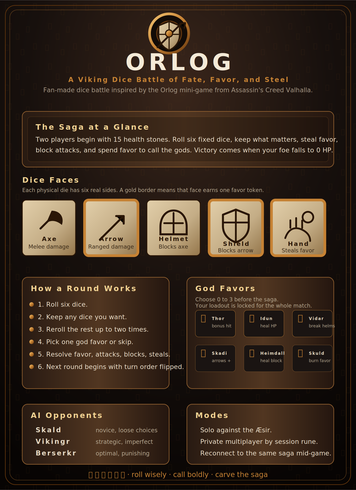

For detailed Orlog rules and background, see the wiki page:

### [Orlog Wiki](https://assassinscreed.fandom.com/wiki/Orlog)

## Android

The Android app is a Capacitor shell around the same Vite build used by the website, so Play Store players and PC browser players use the same Supabase Realtime sessions.

Useful commands:

```sh
pnpm android:sync
pnpm android:debug
pnpm android:bundle
pnpm android:open
```

Capacitor 8 targets Java 21 source compatibility. Use JDK 22 or newer locally, for example:

```sh
export JAVA_HOME=$(/usr/libexec/java_home -v 22)
```
